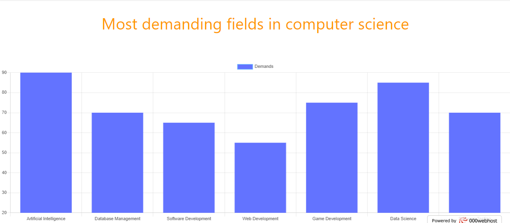
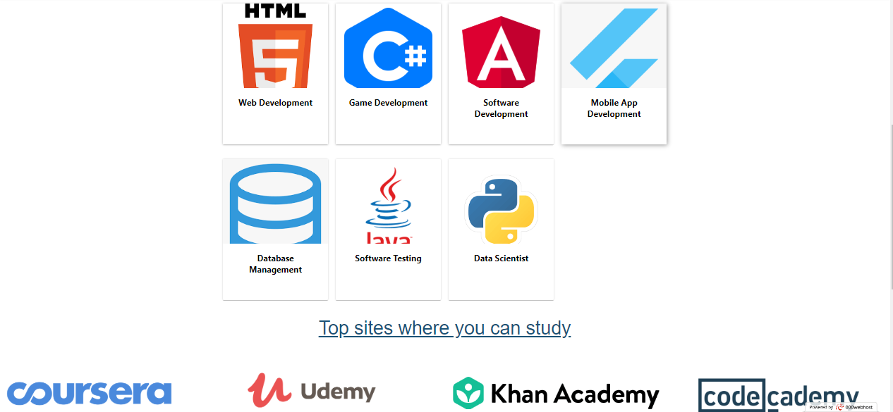
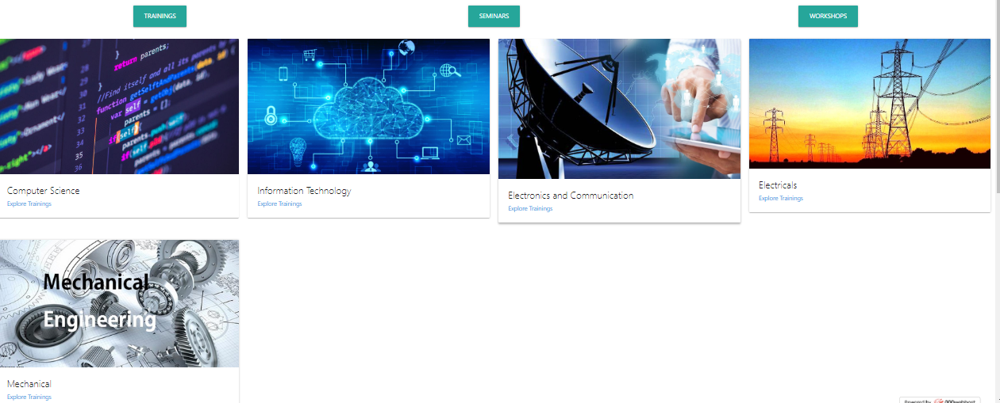
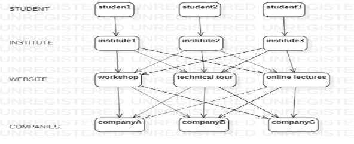

## Undercover - Education

### Project Overview
----------------------------------

<b>A brief description of</b> 
* <b>What problem did the team try to solve</b>:-Students often feel a huge gap between what is taught in college and what they have to do in the real world. Is there a solution to bridge the gap without them taking help of extra courses online. 
* <b>What is the proposed solution</b>
 We are building a solution using a website in which when the user lands on the page he/she will be able to apply for workshops.seminars and trainings. 
 We will also provide a data regarding all the field present in the particular course  and the average demand of the person who     graduates from the course he/she is persuing.  

### Solution Description
1. The approach that we are taking is to create a website/application that would open up a variety of choices for the student to select from various colleges from any stream. 
2. Each  choice would enable them to gain knowledge as well as experience and exposure in real world in their field of interest. 
3. This would enable the students to gain access to the knowledge to knowing that why are they studying the various subjects and what they need to work on to be good at their respective jobs in the future. This will help make their goals and visions much more clear. 
4. We would have collaborations with various companies of different streams, that would be willing to give the students a technical tour of their facilities. This would enable the students to know that what is the use of the theoretical part in real world and also give them an idea of what it is like to work the job that they are pursuing. Tours would be held once the registrations have reached the minimum number of students required. 
5. We would have collaborations with companies of different streams that would be willing to organize workshops in the college itself, where they would make the students aware of the real world applications of their studies, as well as answer to their doubts and questions. Workshop would be held once the registrations have reached the minimum number of students required. 
6. Lastly if the student is unable to attend the live tour as well as the workshop, their would be an online portal, where they can find the choose any course and get to know it's real world application. The videos of the previous tours and workshops would also be available for the students to see and get an idea of what it is like.   
<b>Images of the prototype are attached here with:-</b> 
  
  
  

#### Architecture Diagram

#### Technical Description

<b>An overview of</b> 
<b>Technologies/Version Used:-</b>
1. HTML5
2. CSS3
3. JavaScript
4. Materialize CSS(v1.0.0) 

<b>Setup/Installations required to run the solution</b> 
For Materialize CSS:- https://cdnjs.cloudflare.com/ajax/libs/materialize/1.0.0/css/materialize.min.css 
For Materialize JS:- https://cdnjs.cloudflare.com/ajax/libs/materialize/1.0.0/js/materialize.min.js

### Team Members
 
SrNo | Name  | Email id
:--|:--|:--|
1 | Suryansh Tripathi | suryansh1004@gmail.com
2 | Yoel William | yoelwilliam12345@gmail.com
3 | Vaibhav Mantri | vaibhavmantri824228@gmail.com
4 | Surabh Saxena | rockstar.surabh@gmail.com

